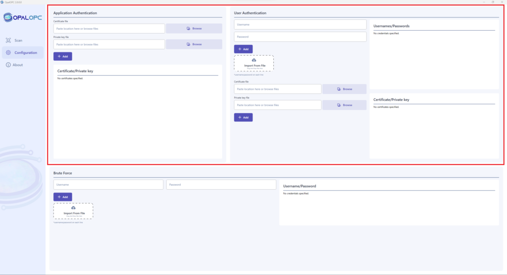
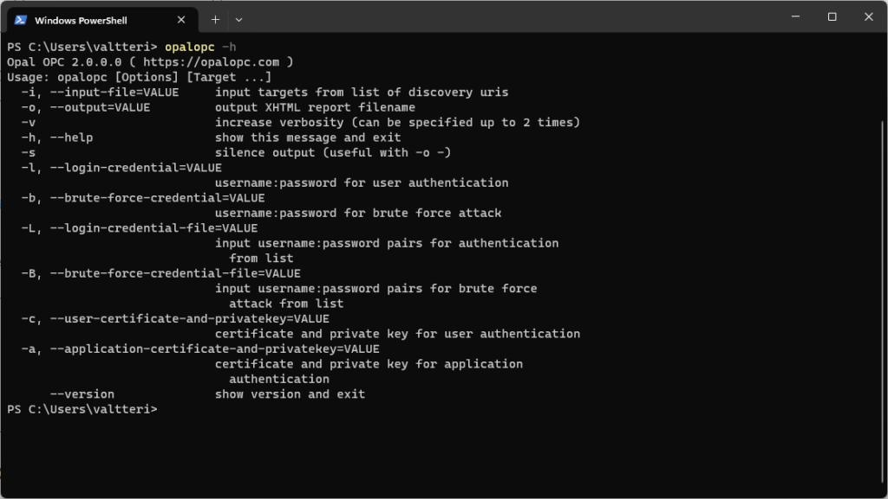
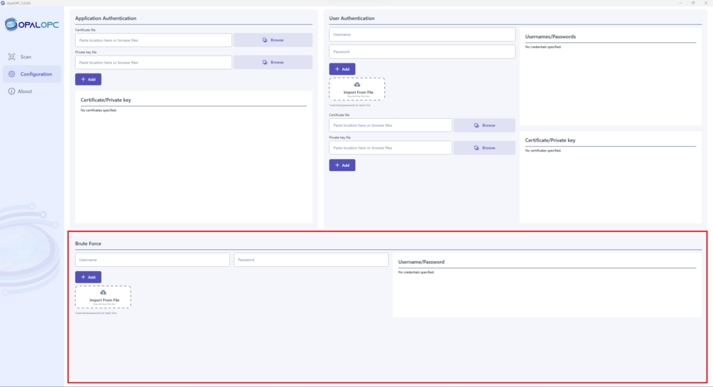

## Support for user-provided credentials

User can now configure credentials for OpalOPC to use when authenticating to target servers. This ensures that security checks requiring authentication are run even if OpalOPC is unable to bypass authentication. It also allows you to quickly check where certain credentials allow access.

OpalOPC supports configuring application certificate, user certificate, as well as username and password. These can be specified multiple times. When configured, all of them are used to authenticate to all target servers. The scan report shows which targets allowed authenticating with which credentials.

User can configure credentials in “Configuration” tab. Application certificates are set in Application authentication section. User certificates and username-password combinations are set in User authentication section.

## New plugin: Brute force

User can now provide username:password combinations that OpalOPC will try against target servers. This allows you to conduct custom password-guessing attacks against OPC UA servers.

Previous versions contain only the [Common credentials plugin](../docs/plugins/common-credentials.md), that guesses a hard-coded list of credentials. You now have the ability to additionally guess any credentials you want.

The difference between guessing usernames and passwords in Brute force and by setting User credentials is that Brute force findings have higher severity.

User can configure username-password combinations in Brute force section in the “Settings” tab.

## Improved performance

Security scans are now faster. Depending on the scan configuration, it may be even 5 times faster than release 1.2.0.0.

## Improved certificate handling

Self-signed certificates created by OpalOPC are now re-used between scans. This avoids polluting target servers’ certificate stores with single-use certificates.

The generated certificates are also better identified to hint server administrators where they come from.

This improvement was thanks to feedback from [Jouni Aro](https://fi.linkedin.com/in/jouni-aro-34b4681) from Prosys OPC.

## Version flag

It is now possible to check the OpalOPC version on CLI with `--version` flag.

