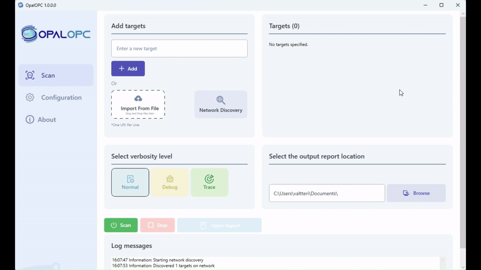
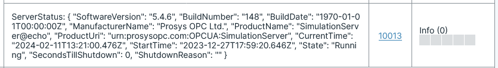
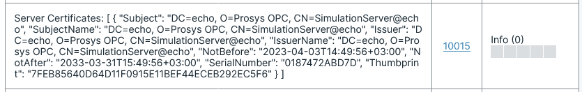
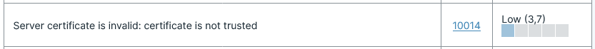

* Network Discovery
* New plugin: [ServerStatus](/docs/plugin-10013)
* New plugin: [Self-signed user certificate](/docs/plugin-10016)
* New plugin: [Server Certificate](/docs/plugin-10015)
* New plugin: [Invalid Server Certificate](/docs/plugin-10014)
* Add new credentials to [Common credentials](/docs/plugin-10003) plugin
* Make reports standalone
* Multiple bugfixes

<!-- truncate -->

## Network Discovery

User can now discover OPC UA servers on the LAN by using the Network Discovery feature. The feature queries servers using mDNS protocol. It finds servers registered on or advertised to a LDS on localhost, and servers that respond to mDNS queries.

On GUI, discovery can be started by clicking the Network Discovery button.

On CLI, discovery can be started by using the `-d` or `--discovery` option.

## New plugin: ServerStatus

[The ServerStatus plugin]//../docs/plugins/serverstatus.md) plugin retrieves the [ServerStatus](https://reference.opcfoundation.org/Core/Part5/v104/docs/12.10) node from the server. This node contains information about the server's current state, as well as its [BuildInfo](https://reference.opcfoundation.org/Core/Part5/v104/docs/12.4).

This information is essential for identifying the scanned server or device.

## New plugin: Self-signed user certificate

[The Self-signed user certificate plugin](/docs/plugin-10016) attempts to authenticate with target servers using a self-signed user certificate.

## New plugin: Server Certificate

[The Server Certificate plugin](/docs/plugin-10015) retrieves the server's certificate.

The certificate data is useful for reconnaissance.

## New plugin: Invalid Server Certificate

[The Invalid Server Certificate plugin](/docs/plugin-10014) checks the validity of target server certificate. The plugin reports an issue if the certificate has expired or is otherwise invalid.

## New credentials to Common credentials

A new set of credentials has been added to the [Common credentials](/docs/plugin-10003) plugin. The new credentials are: `Administrator:1` from [Beckhoff EK9160 manual](https://download.beckhoff.com/download/software/ethercat/ekxxxx/ek9160/IOT_EK9160_OPC-UA_with_UaExpert_en_V1.pdf).
