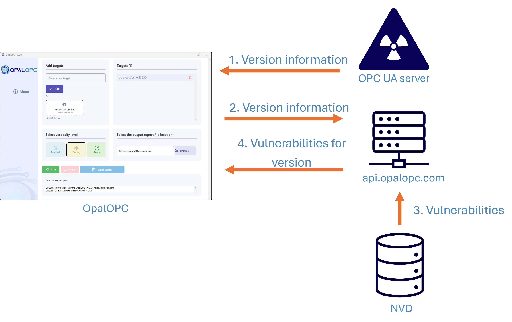

Starting from version 3.1.0.0, OpalOPC detects publicly known vulnerabilities. If your target is running OPC UA server software with associated vulnerabilities in the National Vulnerability Database, they will be included in the scan report.

<!-- truncate -->

Effective search for security issues caused by implementation flaws requires rigorous, time-consuming testing with target-specific customization. This kind of testing is not feasible to be done regularly or on a large scale. OpalOPC was designed to be fully automatic, fast, and gentle with its targets, not causing them to malfunction.

There are security researchers focusing on the potentially product-damaging testing, such as Team82 at Claroty. They have done [great work](https://claroty.com/team82/research/opc-ua-deep-dive-series-a-one-of-a-kind-opc-ua-exploit-framework) in finding security vulnerabilities caused by implementation flaws in OPC UA products. They have even [won prizes](https://www.zerodayinitiative.com/blog/2023/2/16/pwn2own-miami-2023-day-three-results) for their efforts. Their findings, as well as the findings of most other ethical researchers, have been indexed to the [National Vulnerability Database](https://nvd.nist.gov/) (NVD).

Thanks to the NVD, you (and potential attackers) can also benefit from the efforts of these researchers. You can search the database for the software version your targets run to see if they contain vulnerabilities.

Doing this manually for every target is a hardship, though. OpalOPC makes your life easier by automating this process. The new [Known vulnerability plugin](/docs/plugin-10017) queries the NVD API for vulnerabilities behind the scenes, and reports the matching vulnerabilities, requiring no action from your part.

The NVD data is not complete with vulnerability and software version information, thus this will never be a completely foolproof method of finding all known vulnerabilities. We work with NIST to enrich the data as we detect gaps in it, continuously improving the results. The goal is to detect as many vulnerabilities as possible.
