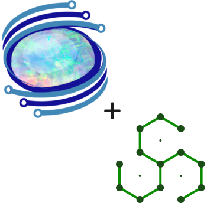

OpalOPC now supports the SARIF output format in version 3.2.0.0. This enhancement allows seamless integration with other tools that also use SARIF, such as GitHub Advanced Security. By adopting SARIF, you gain a unified view of your security posture.

<!-- truncate -->

## What is SARIF?

[SARIF](https://sarifweb.azurewebsites.net/), or Static Analysis Results Interchange Format, is an industry-standard format for the output of static analysis tools. It enables interoperability and integration with various tools and platforms that consume the format.

### Benefits

* **Standardized Reporting**: SARIF provides a consistent format for reporting security findings across different tools and platforms. This consistency simplifies integration with other security tools like [GitHub Advanced Security](https://docs.github.com/en/get-started/learning-about-github/about-github-advanced-security), [Synopsys Software Risk Manager](https://www.synopsys.com/software-integrity/software-risk-manager.html), or [DefectDojo](https://www.defectdojo.com/). This streamlines tracking, triaging, and fixing security issues.
* **Rich Viewing Experience**: There are dedicated SARIF report viewers that provide a richer experience compared to the old plain HTML report. This also allows you to analyze results from various security tools in a unified way.

## How to use it

Simply update to version 3.2.0.0 of OpalOPC to take advantage of this feature. OpalOPC will automatically generate both HTML and SARIF reports with every scan.

You can view a sample report [here](https://gist.github.com/ValtteriL/f640e5c71e7e6c853ca37537ed9253c9).

We believe this new capability will enhance your security testing process, making it more efficient and effective.
