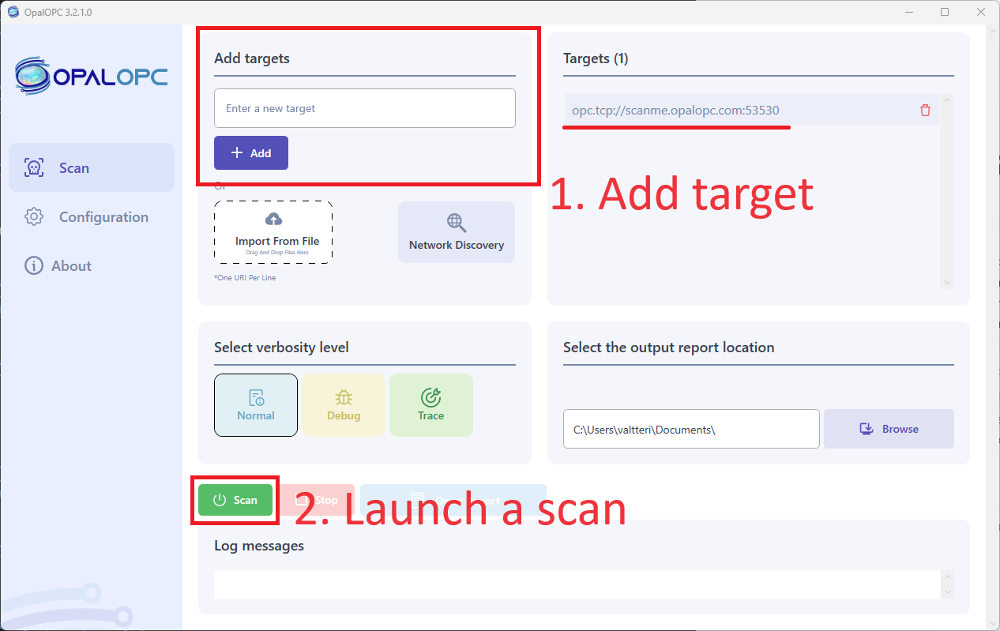
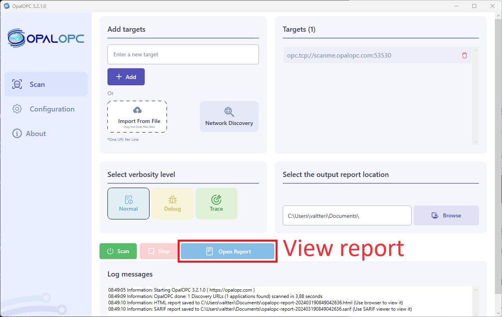

## Install OpalOPC

Install the OpalOPC on your system using the instructions below.

import Tabs from '@theme/Tabs';
import TabItem from '@theme/TabItem';

<Tabs groupId="operating-systems">
  <TabItem value="windows" label="Windows" default>
<a href="https://apps.microsoft.com/detail/OpalOPC/9N89VWR0GK7H?launch=true
	&mode=mini">
	
</a>
  </TabItem>
  <TabItem value="windows-cli" label="Windows (CLI)" default>
<a href="https://apps.microsoft.com/detail/OpalOPC/9N89VWR0GK7H?launch=true
	&mode=mini">
	
</a>
  </TabItem>
  <TabItem value="linux" label="Linux">
    ```bash
    sudo snap install opalopc
    ```

    Or manually:
    
    ```bash
    curl -LO "https://dl.opalopc.com/release/$(curl -L -s https://dl.opalopc.com/release/stable.txt)/bin/linux/amd64/opalopc"
    sudo install -o root -g root -m 0755 opalopc /usr/local/bin/opalopc
    ```
  </TabItem>
</Tabs>

## Obtain & Set license key

Obtain a license key by starting [a free trial or purchasing OpalOPC](/#starthere).

Set the license key using the instructions below.

```bash
opalopc --set-licence-key <license-key>
```

## Scan the test target

<Tabs groupId="operating-systems">
  <TabItem value="windows" label="Windows" default>
  Follow the instructions in screenshot to scan the [test target](test-drive.md):
  
  </TabItem>

    <TabItem value="windows-cli" label="Windows (CLI)" default>
    Use the command line interface to scan the [test target](test-drive.md):
    ```powershell
    opalopc -vv opc.tcp://scanme.opalopc.com:53530 -o opalopc-report
    ```
  </TabItem>
  <TabItem value="linux" label="Linux">
  Use the command line interface to scan the [test target](test-drive.md):
    ```bash
    opalopc -vv opc.tcp://scanme.opalopc.com:53530 -o opalopc-report
    ```
  </TabItem>
</Tabs>


## View the report

<Tabs groupId="operating-systems">
  <TabItem value="windows" label="Windows" default>
  Select `Open Report` to open the report in your default browser:
  
  </TabItem>
    <TabItem value="windows-cli" label="Windows (CLI)" default>
    Run the following command to open the report in your default browser:
    ```powershell
    start opalopc-report.html
    ```
  </TabItem>
  <TabItem value="linux" label="Linux">
  Run the following command to open the report in your default browser:
    ```bash
    open opalopc-report.html
    ```
  </TabItem>
</Tabs>

## Next steps

We've only just scratched the surface of what's possible with the OpalOPC.
Here are a few topics you might want to explore next.

* [Learn how to run your first vulnerability scan](../tutorials/first-vulnerability-scan.md)
* [Learn the tests OpalOPC runs](../faq.md#what-kind-of-tests-does-opalopc-run)
* [GUI usage reference](../gui-reference.md)
* [CLI command reference](../cli-command-reference.md)
* [Read the FAQ](../faq.md)
