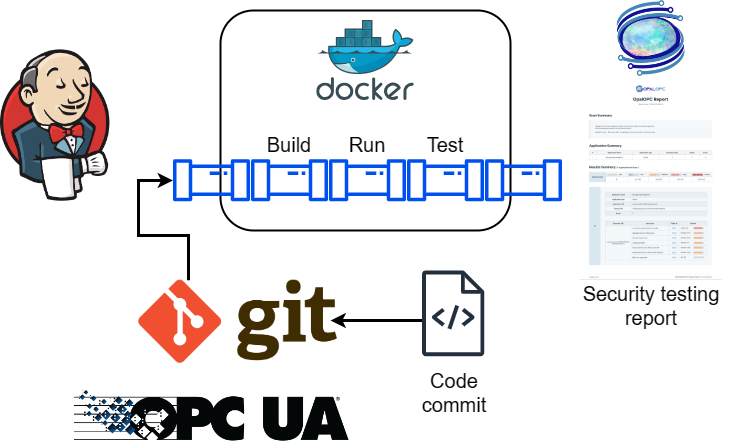
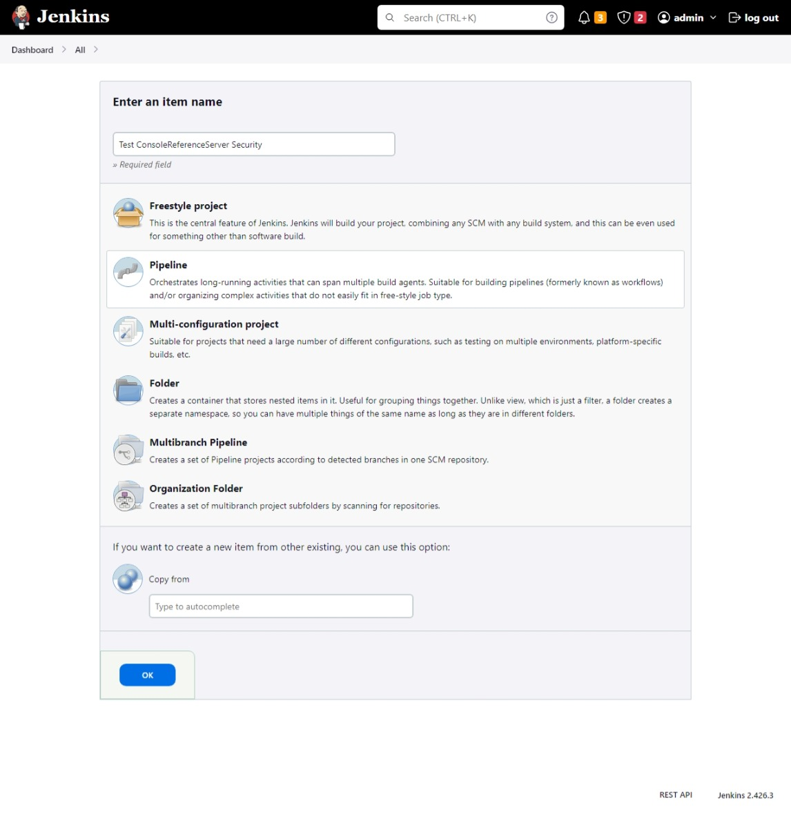
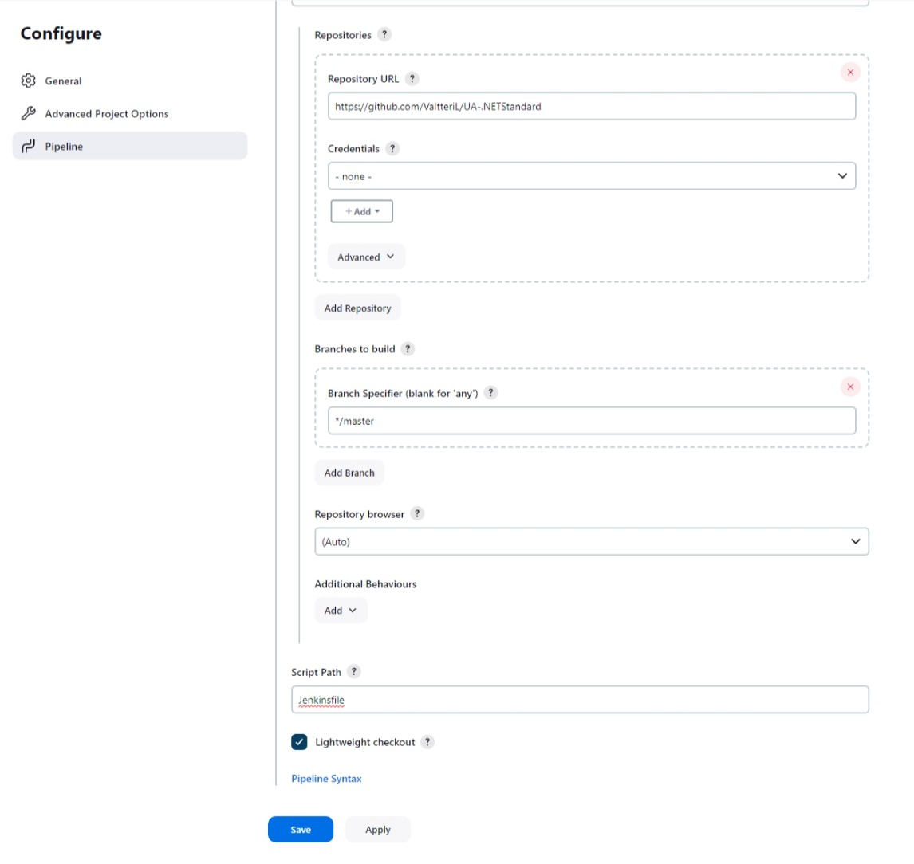
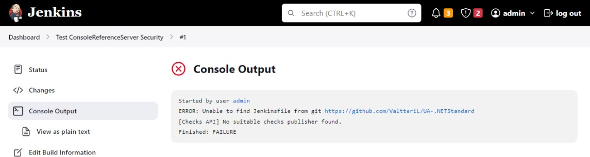
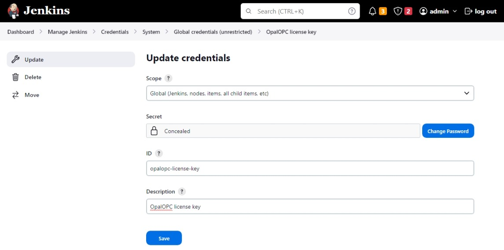
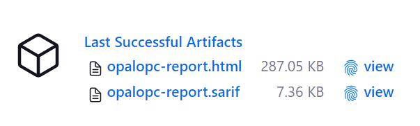
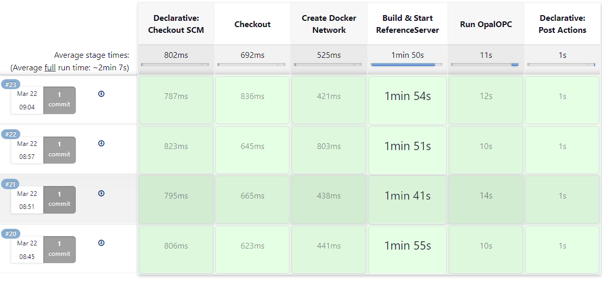

Jenkins is a popular open-source automation server.
Commonly used as an integration and continuous delivery (CI/CD) tool, Jenkins helps to automate the testing and deployment of code.

Security testing is an essential process of ensuring the security of products.
However, it is time-consuming and error-prone if done manually.
Security testing is divided into two main categories: Static Application Security Testing (SAST) and Dynamic Application Security Testing (DAST).

This tutorial shows how you can automate the DAST for an OPC UA server using Jenkins and OpalOPC.
The result is continuous security testing of the server, which allows you to catch any issues as early as possible.

With minor changes, you can adapt this pipeline to test your own OPC UA server.

## Overview

We will be creating a pipeline that clones the Git repository with OPC UA server code, builds and runs the server, scans it with OpalOPC, and finally archives the scanning report for us to download.



The server we will be testing is the [Console Reference Server](https://github.com/OPCFoundation/UA-.NETStandard/tree/master/Applications/ConsoleReferenceServer).

We avoid installing any additional software on the Jenkins server by using Docker containers for the build and scanning processes.

:::note

You can install OpalOPC directly on the Jenkins runner, as well as all the requirements for building the server. However, this is not recommended as it makes the Jenkins server hard to maintain.

:::

## Prerequisites

- [Jenkins](https://www.jenkins.io/download/) installed and running
- The following plugins installed in Jenkins:
    - [Docker Pipeline](https://plugins.jenkins.io/docker-workflow/)
    - [Pipeline](https://plugins.jenkins.io/workflow-aggregator/)
    - [Docker Commons](https://plugins.jenkins.io/docker-commons/)
- Jenkins user can run docker without sudo
- [Git](https://git-scm.com/downloads) installed

## Fork the server repository

1. Fork the [Console Reference Server repository](https://github.com/OPCFoundation/UA-.NETStandard/tree/master/Applications/ConsoleReferenceServer)
1. Clone the forked repository to your local machine

```bash
git clone <your fork uri>
```

:::tip

You can refer to [our fork of the repository](https://github.com/ValtteriL/UA-.NETStandard/) at any time to see the exact changes we made.

:::

## Create a pipeline

1. Login to Jenkins
2. Create a new pipeline in Jenkins, and configure it to fetch the Jenkinsfile from your forked repository.




:::info

You can also use the `Pipeline script` setting to write the pipeline directly in Jenkins. However, this is not recommended as it makes it difficult to version control the pipeline.

:::

3. Select `Build Now` to run the pipeline. Verify you get the error `ERROR: Unable to find Jenkinsfile from git`



4. Create a new file called `Jenkinsfile` in the root of your forked repository with the following content (also available [here](https://gist.github.com/ValtteriL/0d9e784e13ae488a214e6b36bc10f95a#file-jenkinsfile)):

```groovy
pipeline {
    agent any

    stages {
        stage('Checkout') {
            steps {
                checkout scm
            }
        }

        stage('Create Docker Network') {
            steps {
                sh 'docker network create $BUILD_NUMBER-opalopc-network'
            }
        }

        stage('Build & Start ReferenceServer') {
            steps {
                sh '''
                cd Applications/ConsoleReferenceServer/
                docker build -f Dockerfile -t consolerefserver ./../..
                docker run --rm -d --name $BUILD_NUMBER-refserver --network $BUILD_NUMBER-opalopc-network consolerefserver:latest
                '''
            }
        }

        stage('Run OpalOPC') {
            environment {
                OPALOPC_LICENSE_KEY = credentials('opalopc-license-key')
            }
            agent {
                dockerfile {
                    filename 'Dockerfile.opalopc'
                    args '--network=$BUILD_NUMBER-opalopc-network'
                }
            }
            steps {
                sh '''
                export HOME=`pwd`
                opalopc -vv opc.tcp://$BUILD_NUMBER-refserver:62541 -o opalopc-report
                '''

                // Archive results
                archiveArtifacts artifacts: 'opalopc-report.*'
            }
        }
    }
    post {
        always {
            // Kill ReferenceServer if its running
            sh 'docker kill $BUILD_NUMBER-refserver || true'

            // Remove Docker Network if it exists
            sh 'docker network rm $BUILD_NUMBER-opalopc-network || true'
        }
    }
}
````

5. Create a new file called `Dockerfile.opalopc`, also in the root, with the following content (also available [here](https://gist.github.com/ValtteriL/0d9e784e13ae488a214e6b36bc10f95a#file-dockerfile-opalopc)):

```Dockerfile
FROM ubuntu:jammy

# Install dependencies
RUN apt-get update && apt-get install -y \
    curl \
    libicu70

# Install opalopc http://opalopc.com/docs/get-started/install
RUN curl -LO "https://dl.opalopc.com/release/$(curl -L -s https://dl.opalopc.com/release/stable.txt)/bin/linux/amd64/opalopc" \
    && install -o root -g root -m 0755 opalopc /usr/local/bin/opalopc
```

6. Commit & Push the changes to the repository

```bash
git add .
git commit -m "Add pipeline files"
git push
```

7. Configure a new secret text credential in Jenkins with the name `opalopc-license-key` and the value of your OpalOPC license key.



## Get results

After the pipeline is configured, we can run it to get a testing report.

1. Select `Build Now` to run the pipeline. The first run will take a while as Jenkins needs to download and build docker images.
2. Verify the pipeline finishes successfully
3. Select the reports below `Last Successful Artifacts` to download them.



:::note

The HTML report does not display correctly on Jenkins. Therefore you should download it on your machine for viewing.

:::

## Configure continuous testing

Now that we have a working pipeline, we will configure it to run automatically when new code is pushed to the Git repository.

1. Add the following snippet to the Jenkinsfile, under agent:

```jenkinsfile
triggers {
    pollSCM('*/5 * * * *')
}
```
2. Commit & Push the changes to the repository

```bash
git add Jenkinsfile
git commit -m "Add trigger"
git push
```
3. Run the pipeline

Configured this way, Jenkins will check your repository every 5 minutes for new changes and run the pipeline if any are found.
You simply need to check the pipeline results to see if there are any security issues.



:::info

The best practice is to configure webhooks in your Git repository to trigger the pipeline instead of the polling configured here.
This reduces the load on your Git server and ensures that the pipeline is triggered as soon as possible.

:::

## Conclusion

Automating the security testing of OPC UA servers being developed with Jenkins and OpalOPC is a great way to ensure you always have the latest security assessment results at hand.
By tracking the results, you will be the first to learn when a change in the codebase makes your server vulnerable.

Usually, the next step after automation is to configure centralized vulnerability management, which allows you to track the security of your servers over time.
This is especially important in large organizations with many servers.
We cover this in [How to import OPC UA vulnerabilities into DefectDojo](../manage-vulnerabilities-with-defectdojo).
