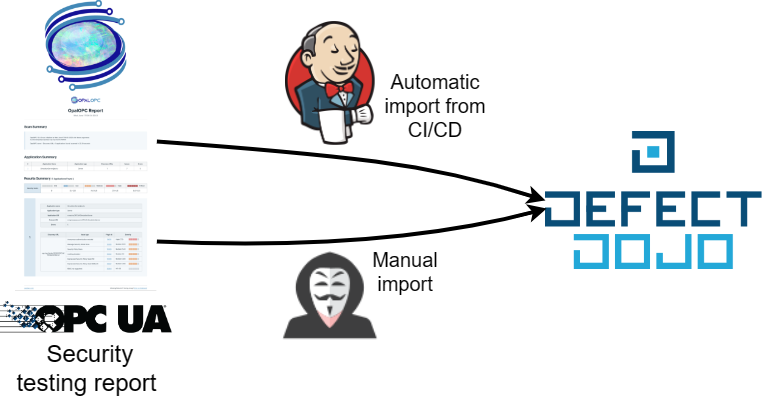
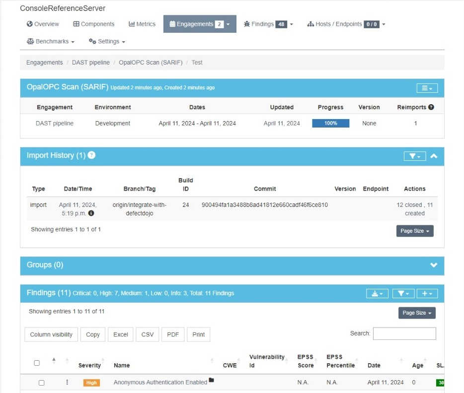

After discovering security issues, the next step is to choose which ones will get fixed and then track the issues until they are fixed.
This process is called vulnerability management.

Effective vulnerability management requires a tool for amassing testing reports from various security tools and filtering the results. Such tools are for instance [OWASP DefectDojo](https://www.defectdojo.org/), [Software Risk Manager](https://www.synopsys.com/software-integrity/software-risk-manager.html), and [Faraday](https://faradaysec.com/).

This tutorial shows how to bring your vulnerabilities discovered with OpalOPC into DefectDojo, so you can manage them. If you are using some other platform, the process is pretty much the same. OpalOPC report uses the SARIF report format, which is understood by all major platforms.

OpalOPC can be run manually by a security tester, or automatically by a CI/CD pipeline.
When running manually, it makes sense to import the report also manually to DejectDojo.
With CI/CD pipelines, automatic importing is desirable.
This tutorial shows you how to do both.

## Overview

We will be tracking vulnerabilities in an OPC UA server using DefectDojo.
The result is a single source of truth for the server's security posture that makes it easy to manage.
The server whose vulnerabilities we will be tracking is the [Console Reference Server](https://github.com/OPCFoundation/UA-.NETStandard/tree/master/Applications/ConsoleReferenceServer).

We will first import testing results manually. Then we will configure a CI/CD pipeline to automate the process.



## Prerequisites

- DefectDojo either installed or bought
- OpalOPC report (If importing manually)
- A DAST CI/CD pipeline with OpalOPC (If importing via CI/CD)

## Register product in DefectDojo

Register the server as a product in DefectDojo.

1. Add product type `OPC UA server`
2. Add product
    - Name: `ConsoleReferenceServer`
    - Description: `<anything>`
    - Product type: `OPC UA server`
    - SLA configuration: `Default`


## Import results

DefectDojo organizes the testing of a product into engagements. Engagement is a point in time when the product is tested.
Each engagement contains one or multiple tests, which correspond to testing reports from different tools.

### Manually

When testing manually, we simply import the testing report into DefectDojo. This automatically creates an AdHoc engagement for us.

1. Open the product
2. Select Findings>Import Scan Results
3. Fill Scan Results
    - Minimum severity: `Info`
    - Active: `Not specified (default)`
    - Verified: `Not specified (default)`
    - Scan type: `SARIF`
    - Environment: Choose one
    - Choose report file: Choose the SARIF report
4. Select Import
5. Do any modifications to test results or engagement if desired

You can now see the issues detected by OpalOPC in the engagement scan findings. The findings are also visible in the product metrics.


Depending on how your security testing practices, you can either reuse the engagement on future tests or create a new engagement each time.
DefectDojo takes care of handling duplicates and closing issues in the same product that are no longer relevant.

### Automatically from CI/CD pipeline

To automatically import scan results, we need to use the DefectDojo API.
We will create a dedicated DefectDojo API user for our pipeline and configure the pipeline in the [Jenkins tutorial](../automated-dast-on-opcua-with-jenkins/) to use it.

#### Create a dedicated API user

1. Create a new user
    - Username: `<anything>`
    - Password: `<choose strong password>`
    - Global role: `API_Importer`
2. Login with the newly created user
3. Navigate to `<your-defectdojo-instance>/api/key-v2`
4. Record the API key

#### Add import step to pipeline

1. Modify the last stage in your DAST pipeline Jenkinsfile to include the following:

```jenkinsfile
stage('Run OpalOPC') {
    environment {
        ...
        DEFECTDOJO_API_KEY = credentials('defectdojo-api-key')
    }
    ...
    steps {
        ...

        // Import results to DefectDojo
        sh '''
        curl -X 'POST' \
            '<YOUR-JENKINS-URI>/api/v2/import-scan/' \
            -H 'accept: application/json' \
            -H "Authorization: Token $DEFECTDOJO_API_KEY" \
            -H 'Content-Type: multipart/form-data' \
            -F 'active=false' \
            -F 'verified=true' \
            -F 'close_old_findings=true' \
            -F 'engagement_name=DAST pipeline' \
            -F "build_id=$BUILD_ID" \
            -F 'deduplication_on_engagement=true' \
            -F 'minimum_severity=Info' \
            -F 'create_finding_groups_for_all_findings=true' \
            -F "commit_hash=$GIT_COMMIT" \
            -F 'product_name=ConsoleReferenceServer' \
            -F 'file=@opalopc-report.sarif' \
            -F 'auto_create_context=true' \
            -F 'scan_type=SARIF' \
            -F "branch_tag=$GIT_BRANCH"
        '''
    }
}
```

The full Jenkinsfile shall look like the one available [here](https://gist.github.com/ValtteriL/0d9e784e13ae488a214e6b36bc10f95a#file-jenkinsfile-defectdojo).

2. Commit & Push the changes to the repository

```bash
git add Jenkinsfile
git commit -m "Import results to DefectDojo"
git push
```

#### Configure API key as Jenkins secret

1. Configure the previously recorded API key as a Jenkins secret with ID `defectdojo-api-key`.
    - Kind: `Secret text`
    - Scope: `Global`
    - Secret: `<the API key>`
    - ID: `defectdojo-api-key`


#### Verify the pipeline works

1. Run the pipeline
2. Verify it runs successfully
3. Verify that there's a new engagement called `DAST pipeline` in your product



Every time the pipeline runs, it automatically updates the vulnerabilities discovered in the `DAST pipeline` engagement with the newest results, closing all fixed ones.
You can see which commit of the product was tested in the Import History.
If you configure your pipeline to run every time the OPC UA server code changes, you always have an updated view of its security posture in DefectDojo.

## Conclusion

Using a vulnerability management tool can help you stay up to date with security issues affecting your products, and speed up their remediation.
OpalOPC works seamlessly with all such major tools, empowering you to keep the OPC UA servers in your products secure with the least effort.
