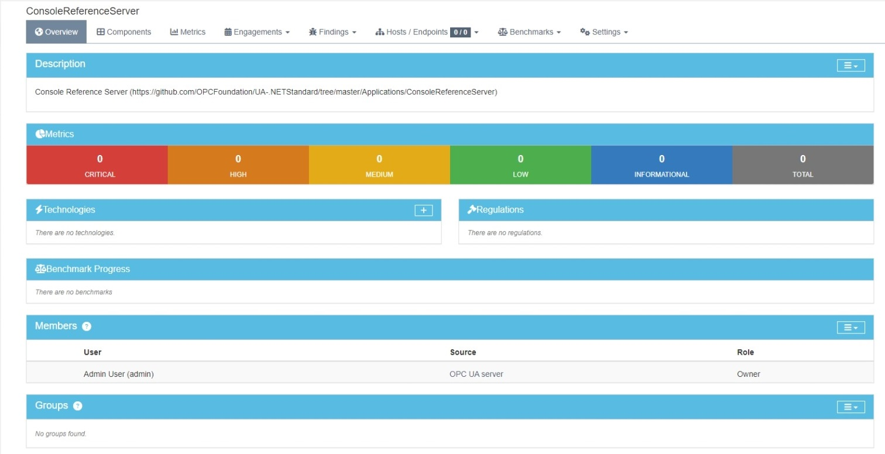
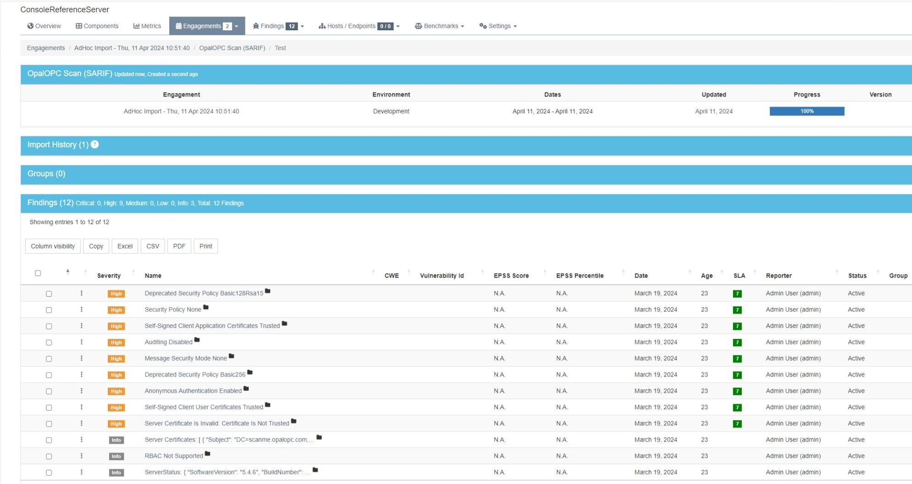
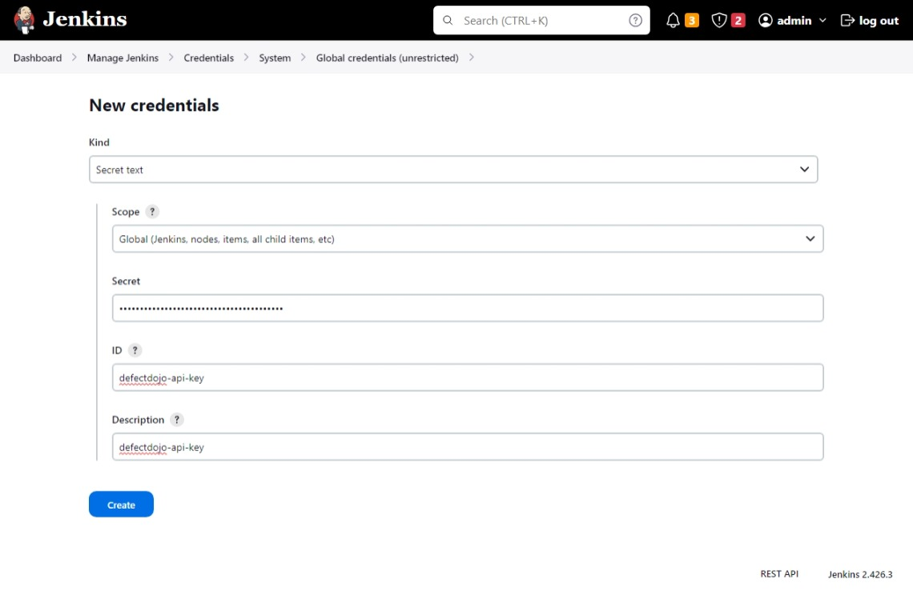

After discovering security issues, the next step is to choose which ones will get fixed and then track the issues until they are fixed.
This process is called vulnerability management.

Effective vulnerability management requires a tool for amassing testing reports from various security tools and filtering the results. Such tools are for instance [OWASP DefectDojo](https://www.defectdojo.org/), [Software Risk Manager](https://www.synopsys.com/software-integrity/software-risk-manager.html), and [Faraday](https://faradaysec.com/).

This tutorial shows how to bring your vulnerabilities discovered with OpalOPC into DefectDojo, so you can manage them. If you are using some other platform, the process is pretty much the same. OpalOPC report uses the SARIF report format, which is understood by all major platforms.

OpalOPC can be run manually by a security tester, or automatically by a CI/CD pipeline.
When running manually, it makes sense to import the report also manually to DejectDojo.
With CI/CD pipelines, the report should be imported automatically.
This tutorial shows you how to do both.

## Overview

KUVA: DefectDojon logo ja joku prosessikaavio niinku Jenkinsissä

We will be tracking vulnerabilities in a OPC UA server using DefectDojo. All testing results will be imported to Defectdojo to track the discovered security issues.
The result is a single source of truth for the security posture that makes it easy to manage the security of the product.

The server we will be tracking is the [Console Reference Server](https://github.com/OPCFoundation/UA-.NETStandard/tree/master/Applications/ConsoleReferenceServer).

We will first import testing results manually. Then we will integrate with a DAST pipeline to automate it.

## Register product in DefectDojo

Register the server as a product in DefectDojo.

1. Add product type `OPC UA server`
2. Add product
    - Name: `ConsoleReferenceServer`
    - Description: `<anything>`
    - Product type: `OPC UA server`
    - SLA configuration: `Default`



## Import results

DefectDojo organizes testing of a product into engagements. Engagement is a point in time when the product is tested.
Each engagement contains one or multiple tests, which correspond to testing reports from different tools.
OpalOPC report is also a test in the eyes of DefectDojo.

### Manually

When testing manually, we simply import the testing report into DefectDojo. This automatically creates an engagement for us.

1. Open the product
2. Select Findings>Import Scan Results
3. Fill Scan Results
    - Minimum severity: `Info`
    - Active: `Not specified (default)`
    - Verified: `Not specified (default)`
    - Scan type: `SARIF`
    - Environment: Choose one
    - Choose report file: Choose the SARIF report
4. Select Import
5. Do any modifications to test results or engagement if desired
6. Select Engagements>View Engagements
7. Close the active engagement

You can now see the issues detected by OpalOPC in the engagement scan findings. The findings are also visible in the product metrics.



Every time you test the server, you need to repeat this process of creating a new engagement and importing the scan results.
DefectDojo takes care of handling duplicates and closing issues in the same product that are no longer relevant.

### Automatically from CI/CD pipeline

To automatically import scan results, we need to use the DefectDojo API.
We will show how to configure a dedicated DefectDojo API user for our pipeline, and configure the pipeline in [Jenkins tutorial](../automated-dast-on-opcua-with-jenkins/) to use it.

#### Create dedicated API user

1. Create a new user
    - Username: `<anything>`
    - Password: `<choose strong password>`
    - Global role: `API_Importer`
2. Login with the newly created user
3. Navigate to `<your-defectdojo-instance>/api/key-v2`
4. Record the API key

#### Add import step to pipeline

1. Modify the last stage in your DAST pipeline Jenkinsfile to include the following:

```jenkinsfile
stage('Run OpalOPC') {
    environment {
        ...
        DEFECTDOJO_API_KEY = credentials('defectdojo-api-key')
    }
    ...
    steps {
        ...

        // Import results to DefectDojo
        sh '''
        curl XXXXXXXXXXXXXXXXXXXXXXXXXXXXXXXXX
        '''
    }
}
```

The full Jenkinsfile shall look as the one available here: XXXXXXXXXXXXXXXXXXXXXXXXXXXXX.

#### Configure API key as Jenkins secret

1. Configure the previously recorded API key as a Jenkins secret with ID `defectdojo-api-key`.
    - Kind: `Secret text`
    - Scope: `Global`
    - Secret: `<the API key>`
    - ID: `defectdojo-api-key`



#### Verify the pipeline works

1. Run the pipeline
2. Verify it runs successfully
3. Verify a new engagement is added to the product in DefectDojo

KUVA: pipelinet vihreällä

Every time the pipeline runs, it will automatically create a new engagement and import the vulnerability scan results.
If you configure your pipeline to run every time the OPC UA server code changes, you will stay on top of its security posture.

## Conclusion

Using a vulnerability management tool can help you stay up to date with security issues affecting your products, and speed up their remediation.
OpalOPC works seamlessly with all such major tools, empowering you to keep the OPC UA servers in your products secure with the least effort.
